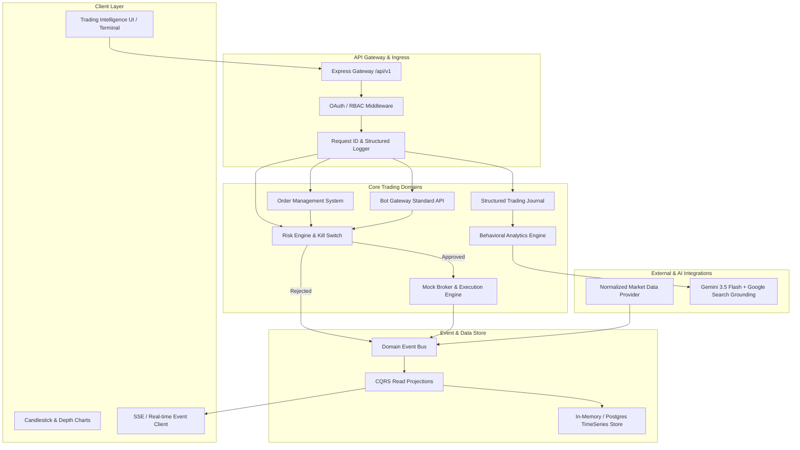

# Trading Intelligence - Architecture & System Design

## Modular Monolith + Event-Driven CQRS Architecture

1. **Explicit Domain Boundaries**:
   - `/auth`: RBAC roles (Trader, Risk Officer, Bot Operator, Auditor).
   - `/accounts`: Multi-account segregation (Prop firms, Crypto exchanges, Margin brokers, Paper sandboxes).
   - `/portfolio`: Derived portfolio projections computed from transaction events.
   - `/orders`: Full state machine (`IDEA` -> `THESIS` -> `PLANNED` -> `ORDER_SUBMITTED` -> `FILLED` -> `POSITION_OPEN` -> `POSITION_CLOSED` -> `REVIEWED`).
   - `/risk`: First-class pre-execution validation with Emergency Kill Switch.
   - `/bots`: Standardized Bot Gateway preventing direct portfolio mutations.
   - `/journal`: Structured post-trade reviews with auto-enrichment.
   - `/behavior`: Statistical behavioral bias detection (streak sizing, FOMO expectancy, premature exit drag).

2. **Event-Driven CQRS**:
   All state mutations emit immutable domain events (`order.submitted`, `order.filled`, `risk.rejected`, `position.closed`). Read models (portfolio metrics, equity curves, slippage distribution) are projections derived from this event stream.
