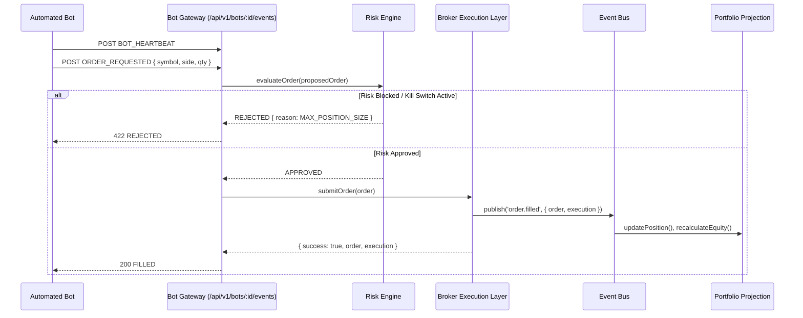

# Bot Gateway Integration & Lifecycle Management

### Prohibitions:
- Bots NEVER directly update account balances, equity, or position tables.
- All requests MUST undergo pre-trade risk evaluation.
- Kill switch activation immediately sets bot states to PAUSED or STOPPED.
