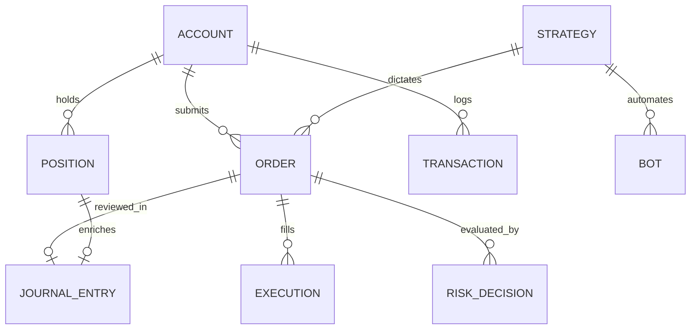

# Data Model & Relational Schema Specification

## Schemas:
- **accounts**: `id (UUID)`, `name`, `broker`, `type`, `currency`, `cashBalance`, `equity`, `marginUsed`, `marginAvailable`, `leverage`
- **orders**: `id`, `accountId`, `symbol`, `side`, `type`, `quantity`, `filledQuantity`, `limitPrice`, `stopPrice`, `avgFillPrice`, `status`, `timeInForce`, `lifecycleStage`, `correlationId`
- **executions**: `id`, `orderId`, `accountId`, `symbol`, `side`, `price`, `quantity`, `fee`, `slippageBps`, `latencyMs`, `timestamp`, `brokerExecutionId`
- **positions**: `id`, `accountId`, `symbol`, `side`, `quantity`, `entryPrice`, `currentPrice`, `liquidationPrice`, `unrealizedPnL`, `realizedPnL`, `stopLoss`, `takeProfit`, `isOpen`
- **journal_entries**: `id`, `symbol`, `direction`, `plannedEntry`, `stopLoss`, `takeProfit`, `positionSize`, `strategy`, `setup`, `tradingThesis`, `invalidationCriteria`, `confidenceScore`, `emotion`, `rMultiple`, `status`
- **bots**: `id`, `name`, `strategyId`, `version`, `status`, `environment`, `connectedAccountId`, `lastHeartbeat`, `lastSignal`, `uptimeSeconds`, `riskStatus`
- **risk_rules**: `id`, `name`, `type`, `threshold`, `unit`, `isEnabled`, `severity`
- **audit_logs**: `id`, `action`, `actor`, `correlationId`, `details`, `ipAddress`, `timestamp`
