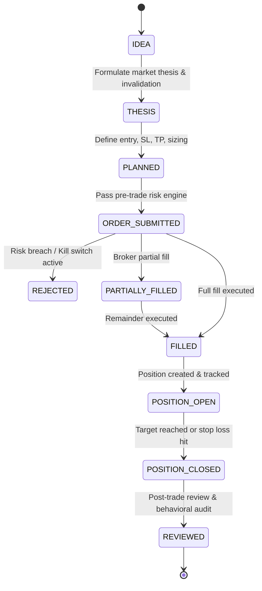

# Trading Workflow & Order Lifecycle

## The Single Central Principle
**Every meaningful trading action becomes structured data that can be analyzed.**
From the initial market observation, through risk checks, simulated or real broker execution, to emotional journaling and statistical post-mortem.
